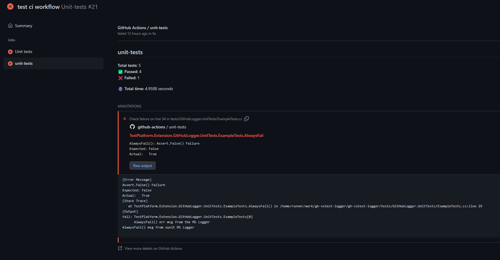
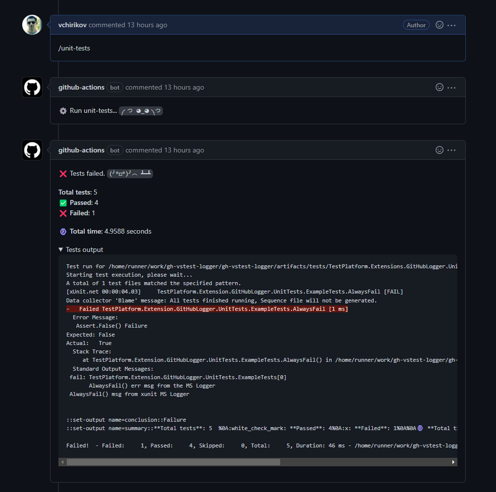

# GitHub Actions adapter for Microsoft.TestPlatform

GitHub `dotnet test` logger without political shit.  

## TLDR 

```bash
dotnet test --logger "github;GITHUB_TOKEN=${{ secrets.GITHUB_TOKEN }}"
```

## Why?

Because technologies must be shared without the idiotic crap in their licenses.  


## Screenshots

  




> **Warning**
> The logger is supposed to **be used from within a GitHub Workflow**,
> since it requires several variables to work (because it uses GitHub Api), 
> and although you can provide them via logger parameters, **this is not recommended**.


## Usage:

```xml
<PackageReference Include="TestPlatform.GitHubLogger" Version="*-*" />
```


```bash
dotnet test --logger "github;name=unit-tests;GITHUB_TOKEN=${{ secrets.GITHUB_TOKEN }}"
```

Parameters can be set with the command line args, or through environment variables.  

We took all default variables from default github actions [environment variables](https://docs.github.com/en/actions/learn-github-actions/environment-variables)
and add `name` & `GITHUB_TOKEN`. All parameters are defined [here](./src/dotnet/GitHubLogger/LoggerParameters.cs).  

After test run the logger produce 2 GitHub Workflow step variables: `conclusion` and `summary`, you can use them in your workflow.  

You can also view [how we use it in our workflows](./.github/workflows/unit-tests.yml).


## Conventions

[Conventional commits](https://www.conventionalcommits.org/en/v1.0.0/)

## Versioning

Read [Nerdbank.GitVersioning docs](https://github.com/dotnet/Nerdbank.GitVersioning/blob/master/doc/nbgv-cli.md)  

```bash
dotnet nbgv prepare-release beta
```

Use the `alpha` suffix in the `master` branch, `beta`,`rc-*` in release branches. When a release branch drops the version suffix it becomes a production release.


| Example                   | Formula                                                  | Public branch | Prerelease suffix | Example explanation                                                   |
| ------------------------- | -------------------------------------------------------- | ------------- | ----------------- | --------------------------------------------------------------------- |
| 2.46.2                    | {Major}.{Minor}.{GitHeight}{PreReleaseSuffix}            | true          | null              | public branch `master`, version.json without any `-prerelease` suffix |
| 1.46.2-beta               | {Major}.{Minor}.{GitHeight}{PreReleaseSuffix}            | true          | `-beta`           | public branch `release/v1.4`, version.json with `-beta` suffix        |
| 2.46.2.gba19945638        | {Major}.{Minor}.{GitHeight}.g{GitHash}                   | false         | null              | non-public branch `feat1`, version.json without suffix                |
| 2.46.2-custom.gba19945638 | {Major}.{Minor}.{GitHeight}{PreReleaseSuffix}.g{GitHash} | false         | `-custom`         | non-public branch `feat1`,  version.json with `-custom` suffix        |


## Commit messages

We use [conventional commits](https://www.conventionalcommits.org). For writing a conventional commit message, you can use
your default message editor, CLI tool or IDE plugin.

### CLI tool

1. Install CLI tool
  
  ```bash
  npm install -g commitizen
  ```

1. [Make the repo Commitizen-friendly](https://github.com/commitizen/cz-cli#making-your-repo-commitizen-friendly)

1. Run wizard of cli tool

  ```bash
  git cz
  ```

### IDE Plugins

* [Plugin with GUI](https://marketplace.visualstudio.com/items?itemName=mrluje.vs-commitizen) for Visual Studio
* [Plugin with GUI](https://plugins.jetbrains.com/plugin/9861-git-commit-template) for Rider